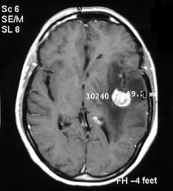
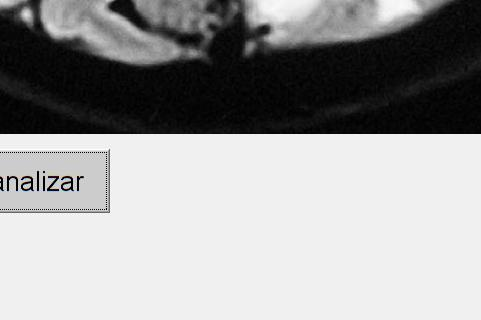

# Brain Tumor Detection App (MATLAB)

A small MATLAB desktop application that loads a brain MRI image, segments the brightest high-density region with classic image-processing operations, and outlines it in red as a candidate tumor.

| Input (sample MRI) | Historical output captured by the program |
| --- | --- |
|  |  |

## Project Overview

The application is a GUIDE-based MATLAB GUI (`Proyecto`) with one button. When pressed, the user picks an image file, the image is converted to grayscale and shown on the left axes, and a detection function (`braintumordetector`) thresholds the image, keeps the largest solid bright region, dilates it and draws its contour in red over the image.

It is a **classic computer-vision** approach (thresholding + connected components + morphology). There is no machine learning involved.

## Project Context

**Project origin: Academic / University Project** (course project).

| | Status | Evidence |
| --- | --- | --- |
| Course: *Visión Robótica* (Robotic Vision) | Confirmed | Header of `src/braintumordetector.m`: *"PROYECTO DE VISIÓN ROBÓTICA"* |
| Team: José Manuel Barajas Ramírez and Omar Baruch Morón López | Confirmed | Header of `src/braintumordetector.m`: *"EQUIPO INTEGRADO POR: …"* |
| Developed in November 2018 | Confirmed | GUIDE timestamp `24-Nov-2018` in `Proyecto.m`; `.fig` created 26 Nov 2018; sample images dated 24 Nov 2018 |
| Developed on Windows 64-bit | Confirmed | `.fig` file header: `platform PCWIN64` |
| Published to GitHub in February 2021 | Confirmed | Git history (commits dated 2021-02-20) |
| University, instructor, formal requirements | Unknown | No assignment or report documents are present in the repository |

More detail in [docs/project-context.md](docs/project-context.md).

## Problem Statement

Detect and highlight a brain tumor in a magnetic resonance image (*RMN – Resonancia Magnética Nuclear*) using image processing techniques (*"Detección de tumores cerebrales mediante procesamiento de imágenes"*).

## Objective

Provide a simple GUI where an MRI image can be selected and the suspected tumor area is automatically segmented and outlined. The GUI panel is titled *"Anomalias en la masa encefalica"* (anomalies in the brain mass).

## Repository Structure

```
.
├── README.md
├── LICENSE                     # MIT license (original)
├── src/                        # Original MATLAB source – unchanged
│   ├── Proyecto.m              # GUIDE GUI code (entry point)
│   ├── Proyecto.fig            # GUIDE figure layout (binary MAT-file)
│   └── braintumordetector.m    # Detection algorithm
├── data/
│   ├── sample-mri/             # Sample MRI images used as input (original filenames kept)
│   └── output/
│       └── braintumordetected.jpg   # Historical frame produced by the program
└── docs/
    ├── project-context.md
    ├── code-overview.md
    └── possible-improvements.md
```

## Original Implementation

This repository preserves the original implementation of the project. The source code has intentionally not been refactored or modernized in order to retain the historical context and original development approach.

The source code represents the original implementation developed during my university studies. Files in `src/` are byte-for-byte identical to the originally uploaded files (they were only moved from `bin/` to `src/`). Code comments are in Spanish and the `.m` files use Latin-1 (Windows-1252) encoding, as originally written.

## Technologies

- **MATLAB** (GUIDE v2.5 for the GUI)
- **Image Processing Toolbox** — `imfilter`, `imbinarize`, `bwlabel`, `regionprops`, `strel`, `imdilate`, `bwboundaries`, `label2rgb`, `rgb2gray`

`imbinarize` was introduced in MATLAB R2016a, so that release or newer is required (inferred from the functions used; the exact version used in 2018 is not recorded).

## How It Works

1. **Select image** – *"Seleccionar Imagen para analizar"* opens a file dialog (`uigetfile`).
2. **Grayscale** – the image is read and converted with `rgb2gray`, then shown on the left axes (*"RMN"*).
3. **Smoothing** – a 3×3 averaging kernel is applied (`imfilter`). *Note: the result is computed but not used by later steps.*
4. **Thresholding** – the grayscale image is binarized with a fixed threshold of `0.7`.
5. **Region selection** – connected components are labelled; among regions with `Solidity > 0.5`, the one with the largest area is kept as the tumor.
6. **Morphology** – the region is dilated with a 5×5 square structuring element.
7. **Contour** – `bwboundaries` extracts the outline, which is plotted in red (`LineWidth` 2) over the image.
8. **Capture** – `getframe(gca)` captures the axes as the function's output.

Step-by-step details, including where comments and code differ, are in [docs/code-overview.md](docs/code-overview.md).

## Inputs and Outputs

- **Input:** any image file readable by `imread` and convertible by `rgb2gray` (i.e. RGB). The images in [`data/sample-mri/`](data/sample-mri/) are the samples kept with the project.
- **Output:** a red contour drawn on the GUI axes, and a frame struct returned by `braintumordetector`. The right-hand axes (*"Deteccion de Irregularidad"*) is not filled, because the line that would display the result there is commented out.
- [`data/output/braintumordetected.jpg`](data/output/braintumordetected.jpg) is a historical file with the same name as the one in a commented-out `imwrite` call. It appears to be a screen capture of part of the GUI (the image and the edge of the button), not a clean result image.

## Running the Project

Based on standard GUIDE conventions (not documented in the original repository):

1. Open MATLAB (R2016a or newer) with the Image Processing Toolbox.
2. Set the current folder to `src/` (`Proyecto.m` and `Proyecto.fig` must stay together).
3. Run `Proyecto` in the Command Window.
4. Click **"Seleccionar Imagen para analizar"** and pick an image, e.g. from `data/sample-mri/`.

This has not been re-tested for this documentation; behavior on current MATLAB releases may differ (GUIDE is deprecated in recent MATLAB versions).

## Documentation

- [Project context](docs/project-context.md) — origin, dates, authors, scope, sample data provenance
- [Code overview](docs/code-overview.md) — file-by-file and line-level explanation, GUI layout recovered from `Proyecto.fig`
- [Possible improvements](docs/possible-improvements.md) — observations only, **not applied**

## Historical Note

This repository was later reorganized and documented to improve readability and preserve the historical context of the original project. The original source code remains unchanged.

## Disclaimer

This is a student course project. It is not a medical device and must not be used for diagnosis.

## License

[MIT](LICENSE)
